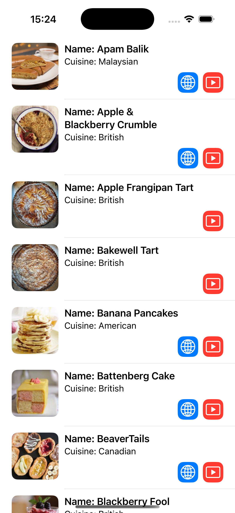

### Summary:

Application presenting a list of recipes.

Core features:

1. Fetch and display a list of recipes from remote.
2. Navigate to recipe source.
3. Navigate to recipe youtube video.

### Focus Areas: What specific areas of the project did you prioritize? Why did you choose to focus on these areas?

1. MVVM arhitecture. It is the application backbone.
2. SwiftUI separation. Large views are not great.
3. Concurrency. I used Swift 6 concurrency mode so it gave some trouble.
4. Image loading system. The whole load, cache, deduplicate requests logic is kinda more complex than the app itself.

### Time Spent: Approximately how long did you spend working on this project? How did you allocate your time?

~10 hours over 3 days.

The rough timeline:

1. Initial setup of recipe fetch and presentation omitting image loading.
2. Image loading and caching.
3. App polising and tests.

### Trade-offs and Decisions: Did you make any significant trade-offs in your approach?

There are no significant trade-offs, but the app would need various improvements based on scaling direction.

### Weakest Part of the Project: What do you think is the weakest part of your project?

1. DI and routing system is abscent. For now I used default parameters and singeltons for DI.
2. Details view might use a separate viewModel if it becomes more complex. For example if external link opening needs extra handling.
3. Integration tests would really help.

### Additional Information: Is there anything else we should know? Feel free to share any insights or constraints you encountered.

1. Swift 6 concurrency mode is giving not very helpful errors. It is easy to miss something until integration and go around fixing stuff.
2. SwiftUI cannot into bindable protocols. This makes mocking view models for preview more cumbersome.
